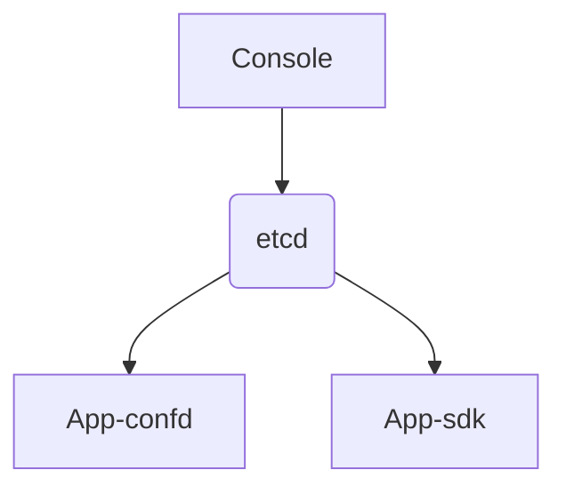

# xconf 配置中心
Inspire from etcd and nacos

## Design

## 关键设计要求
配置中心设计要求：

* 足够简单，部署足够简单，使用足够简单
* 高可用，高性能
* 权限管理 rbac
* 版本管理，查看变更内容，回滚版本
* 配置变更内容能够快速通知到客户端
* 各语言客户端能够方便接入
* confd
* 灰度 ?
* 多环境 ?

## 设计

etcd 已经支持了上述所有设计要求，那我们还需要做些什么呢？

通过提供管理UI，带来配置使用和管理的最佳实践

etcd 配置规范：  
/xconf/{{namespace}}/{{group}}/{{name}}  
/xconf/{{namespace}}/{{group}}/{{name}}.metadata  

概念说明：  
namespace: 命名空间，可用于多租户，多环境  
group: 配置文件目录，可用于项目、团队等纬度  
name: 配置文件，如 foo.json  

metadata:
纪录文件md5
创建时间
最后更新时间
版本号
灰度表达式
备注等
